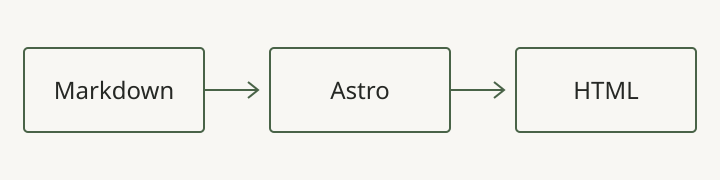

This **example draft** exists only to check rendering. It is not a personal
article by Niklas Dittmann and remains unpublished.

## Text and structure

Short paragraphs, descriptive headings and concrete examples make technical
content easier to read. This paragraph checks the reading width.
A [link to the blog](/en/blog/) and `inline code` are also part of the test.

- Markdown remains the source.
- Astro generates static HTML.
- A draft is reachable only at its direct URL during development.

> Do not publish this fixture as a real article. Create a new folder for your
> own writing.

## Code

```ts
const message = 'A deliberately long line to check keyboard scrolling on narrow screens without making the whole page overflow.';
console.log(message);
```

## Image



This translation shares the original draft's local diagram. It is a test image,
not evidence of a project.

## Table

| Source | Result |
| --- | --- |
| Markdown | Static HTML |
| Draft | Local preview |
